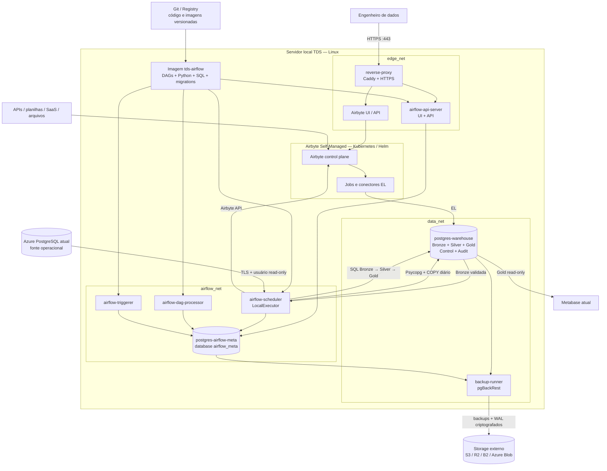
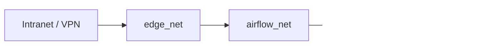
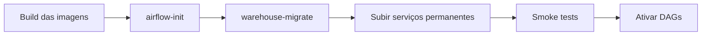
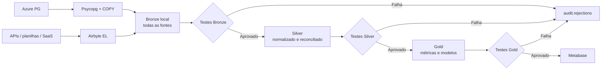
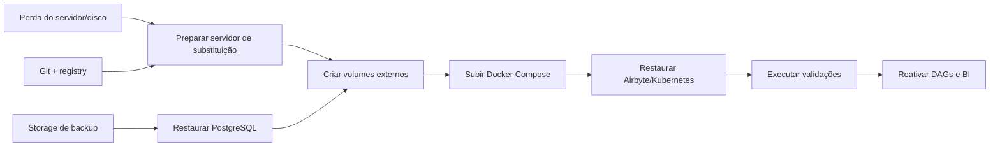

# Plataforma de Dados TDS

## Documento de arquitetura e operação

**Versão:** 0.3  
**Status:** arquitetura inicial proposta  
**Data:** 2026-08-17  
**Objetivo:** construir uma plataforma analítica PostgreSQL em camadas, executada em servidor local Linux, com Airflow como orquestrador, Airbyte como ferramenta de EL para APIs e planilhas e Bronze local como ponto único de entrada dos dados.

**Decisões substituídas nesta versão:** Azure deixa de ser “Bronze externa”; Azure não alimenta mais a Silver diretamente; a hospedagem deixa de ser VPS; Airbyte passa a compor a camada de ingestão; e `airflow-triggerer` passa a ser obrigatório no desenho-base.

---

## 1. Resumo executivo

A primeira versão será executada em um servidor local Linux. O núcleo da plataforma será gerenciado por Docker Compose e terá:

- um PostgreSQL exclusivo para o warehouse;
- um PostgreSQL exclusivo para os metadados do Airflow;
- Airflow com `LocalExecutor`;
- Caddy como reverse proxy HTTPS;
- pgBackRest para backup e recuperação point-in-time;
- código Python e SQL versionado no Git;
- backup armazenado fora do servidor principal;
- Metabase como consumidor externo da camada Gold;
- cópia diária do Azure PostgreSQL para a Bronze local;
- Airbyte Self-Managed como mecanismo de EL para APIs, planilhas e outras fontes suportadas;
- Silver lendo exclusivamente dados já persistidos na Bronze;
- Airflow coordenando carga Azure, sincronizações do Airbyte, transformações, testes e publicação.

No warehouse será utilizado um único banco chamado `tds_warehouse`, organizado nos schemas:

```text
Azure PostgreSQL ── Psycopg + COPY ──┐
                                     ├→ bronze → silver → gold
APIs / planilhas ───── Airbyte ──────┘
                                                ↘ control / audit
```

A Bronze será a cópia analítica e rastreável das fontes. O Azure será sincronizado diariamente por uma DAG que usa duas conexões PostgreSQL e streaming `COPY TO STDOUT` → `COPY FROM STDIN` por Psycopg. APIs, planilhas e outras fontes serão extraídas e carregadas pelo Airbyte no mesmo schema Bronze.

Bronze não substitui backup de desastre. A cópia Bronze serve ao processamento analítico, histórico e reprocessamento; pgBackRest e cópias externas continuarão responsáveis por recuperação operacional.

---

## 2. Decisões arquiteturais

| Tema | Decisão inicial |
|---|---|
| Banco analítico | PostgreSQL sem Supabase |
| Organização | Um banco `tds_warehouse` com schemas em camadas |
| Orquestração | Apache Airflow 3 com `LocalExecutor` |
| Hospedagem | Servidor local Linux com recursos já validados pela equipe |
| Deploy do núcleo | Docker Compose |
| Entrada HTTPS | Caddy |
| Fonte principal inicial | Azure PostgreSQL atual |
| Carga Azure → Bronze | Python + Psycopg + streaming `COPY` + carga idempotente |
| Outras fontes | Airbyte Self-Managed para APIs, planilhas e conectores suportados |
| Ponto único de entrada | Schema `bronze` do `tds_warehouse` |
| Leitura da Silver | Exclusivamente Bronze local |
| Periodicidade Azure | Sincronização diária; estratégia física definida por tabela |
| Transformações relacionais | SQL executado pelo Airflow |
| Controle de estrutura | Migrations versionadas com Alembic |
| Backup PostgreSQL | pgBackRest + WAL contínuo + storage externo |
| BI | Metabase lendo somente a Gold |
| Alta disponibilidade | Não incluída na primeira versão |
| Atualização | Diária para Azure; por SLA para conexões Airbyte |

---

## 3. Diagrama geral



---

## 4. Inventário exato da primeira versão

### 4.1 Imagens do núcleo Docker Compose

A arquitetura-base utiliza **3 imagens Docker distintas**.

| Nº | Imagem | Origem | Usada por |
|---:|---|---|---|
| 1 | `tds-airflow:<versão>` | Imagem própria baseada na imagem oficial do Airflow | API Server, Scheduler, DAG Processor, Triggerer e containers temporários |
| 2 | `tds-postgres-pgbackrest:<versão>` | Imagem própria baseada no PostgreSQL oficial | Warehouse, Airflow Meta e Backup Runner |
| 3 | `caddy:<versão-fixada>` | Imagem oficial | Reverse proxy |

As tags deverão ser fixadas. Não utilizar `latest` em produção.

O Airbyte não será contado como uma única imagem ou um único container. O Airbyte Self-Managed atual é composto por múltiplas imagens e workloads gerenciados por Kubernetes/Helm. Em desenvolvimento será instalado com `abctl`; em produção, a implantação deverá usar uma versão fixada do chart Helm no servidor local.

Exemplo conceitual:

```text
tds-airflow:1.0.0-airflow3.3.0
tds-postgres-pgbackrest:1.0.0-pg17
caddy:2.x.y
```

### 4.2 Containers permanentes

A arquitetura-base do Docker Compose utiliza **8 containers permanentes**.

| Nº | Container | Imagem | Função |
|---:|---|---|---|
| 1 | `reverse-proxy` | `caddy` | HTTPS e roteamento para a interface do Airflow |
| 2 | `postgres-warehouse` | `tds-postgres-pgbackrest` | Banco `tds_warehouse` |
| 3 | `postgres-airflow-meta` | `tds-postgres-pgbackrest` | Banco interno `airflow_meta` |
| 4 | `airflow-api-server` | `tds-airflow` | UI e API REST do Airflow |
| 5 | `airflow-scheduler` | `tds-airflow` | Agenda DAGs e executa tarefas pelo `LocalExecutor` |
| 6 | `airflow-dag-processor` | `tds-airflow` | Processa e serializa os arquivos das DAGs |
| 7 | `airflow-triggerer` | `tds-airflow` | Aguarda sincronizações Airbyte e outras tarefas deferrable sem ocupar slot de execução |
| 8 | `backup-runner` | `tds-postgres-pgbackrest` | Agenda backups e envia para storage externo |

### 4.3 Containers temporários

Existem **2 containers temporários**, que executam uma ação e encerram.

| Container | Momento de execução | Função |
|---|---|---|
| `airflow-init` | Instalação e upgrades | Executa migrations internas do Airflow e configura o ambiente inicial |
| `warehouse-migrate` | Deploy do warehouse | Executa migrations do `tds_warehouse` |

Esses containers reutilizam a imagem `tds-airflow` e não ficam consumindo recursos permanentemente.

### 4.4 Runtime do Airbyte

O Airbyte será uma implantação separada do Compose principal:

| Ambiente | Implantação proposta | Observação |
|---|---|---|
| Desenvolvimento | `abctl local install` sobre Docker/Kind | Ambiente de aprendizado e validação |
| Produção | Kubernetes single-node + Helm com versão fixada | Persistência, recursos, backup e upgrades controlados |

O número de pods e containers varia conforme a versão, os conectores e os jobs ativos. Por isso não será tratado como uma quantidade fixa no inventário do Docker Compose.

### 4.5 Alterações no ambiente Docker já iniciado

Os dois containers PostgreSQL existentes continuam válidos e não precisam ser recriados por causa das novas decisões.

Alterações necessárias:

1. manter `postgres-warehouse` e `postgres-airflow-meta`;
2. manter os schemas `bronze`, `silver`, `gold`, `control` e `audit`;
3. acrescentar o provider Airbyte à imagem do Airflow:

```text
apache-airflow-providers-airbyte==5.5.2
```

4. reconstruir `tds-airflow` após alterar `requirements.txt`;
5. adicionar `airflow-triggerer` ao Compose para jobs Airbyte assíncronos/deferrable;
6. criar o papel PostgreSQL `airbyte_loader` com escrita somente na Bronze;
7. instalar Airbyte separadamente com `abctl` em desenvolvimento;
8. não adicionar um serviço fictício `airbyte:` único ao `docker-compose.yml`;
9. planejar volumes/persistent volumes e backup do Airbyte fora dos seis volumes do Compose;
10. configurar a conectividade Airbyte → warehouse pela rede privada do host.

Exemplo do serviço adicional:

```yaml
airflow-triggerer:
  <<: *airflow-common
  command: triggerer
  restart: unless-stopped
```

Em desenvolvimento com Docker Desktop, o Airbyte poderá acessar o warehouse pela porta publicada do host, por exemplo `host.docker.internal:5433`. No servidor Linux, usar o endereço privado estável do servidor, firewall e `pg_hba.conf`; não usar `localhost` dentro dos pods.

### 4.6 Monitoramento opcional

Não faz parte da contagem inicial. Pode ser adicionado na segunda etapa:

| Container | Função |
|---|---|
| `postgres-exporter` | Métricas PostgreSQL |
| `node-exporter` | Métricas do servidor local |
| `cadvisor` | Métricas dos containers |
| `prometheus` | Coleta de métricas |
| `grafana` | Dashboards e alertas |

### 4.7 Resumo das quantidades

```text
Imagens distintas do núcleo Compose:          3
Containers permanentes do núcleo Compose:     8
Containers temporários:                       2
Volumes externos persistentes:                6
Redes Docker:                                 3
Bancos PostgreSQL:                            2
Schemas analíticos/técnicos do warehouse:     5
Workloads Airbyte/Kubernetes:                  quantidade dinâmica
```

---

## 5. Redes Docker

Serão utilizadas **3 redes**.

| Rede | Serviços | Finalidade |
|---|---|---|
| `edge_net` | Caddy, Airflow API Server e proxy para Airbyte | Entrada HTTPS/intranet |
| `airflow_net` | Componentes do Airflow e banco de metadados | Controle do orquestrador |
| `data_net` | Scheduler, warehouse e backup runner | Execução dos pipelines e backups |

O PostgreSQL não publicará a porta `5432` na internet. Para os jobs Airbyte executados no Kubernetes local, o warehouse será acessível somente pela rede privada do servidor, com firewall e `pg_hba.conf` restritos às sub-redes do runtime.



---

## 6. Bancos e schemas

### 6.1 PostgreSQL do warehouse

Container:

```text
postgres-warehouse
```

Banco:

```text
tds_warehouse
```

Schemas:

| Schema | Responsabilidade |
|---|---|
| `bronze` | Cópias rastreáveis de todas as fontes: Azure, APIs, planilhas e SaaS |
| `silver` | Dados tipados, normalizados, deduplicados e reconciliados |
| `gold` | Fatos, dimensões e datasets para o BI |
| `control` | Watermarks, configurações e estado dos pipelines |
| `audit` | Execuções, rejeições e resultados de qualidade |

PostgreSQL não possui schemas aninhados. Portanto, os schemas de origem do Azure serão preservados no nome das tabelas Bronze usando o padrão:

```text
bronze.<fonte>__<schema_origem>__<tabela_origem>
```

Exemplos:

```text
bronze.azure__forms__submissions
bronze.azure__vendas__vendas_unificada
bronze.azure__clint__contacts
bronze.sheets__marketing__metas_mensais
bronze.api__crm_externo__contacts
```

O mapeamento oficial será registrado em `control.source_objects`. Tabelas temporárias ou `UNLOGGED` poderão ser usadas internamente para publicação atômica, mas não serão consideradas uma camada arquitetural.

O schema `public` não será utilizado para tabelas analíticas e terá permissões restritas.

### 6.2 PostgreSQL de metadados do Airflow

Container:

```text
postgres-airflow-meta
```

Banco:

```text
airflow_meta
```

Ele guarda somente informações internas do Airflow:

- DAG runs;
- task instances;
- estados;
- retries;
- Connections;
- Variables;
- XComs pequenos;
- histórico operacional.

Ele não guarda leads, vendas, deals ou arquivos de dados.

---

## 7. Papéis e permissões

| Papel | Permissão proposta |
|---|---|
| `warehouse_admin` | Administração do warehouse e migrations |
| `airflow_pipeline` | Escrita na Bronze para cargas Azure; leitura/escrita em Silver, Gold, Control e Audit |
| `airbyte_loader` | Escrita apenas nas tabelas/prefixos Bronze destinados ao Airbyte |
| `source_writer` | Escrita limitada em tabelas Bronze específicas, quando necessário |
| `metabase_reader` | `SELECT` somente na Gold |
| `analyst_reader` | `SELECT` em Silver e Gold, conforme necessidade |
| `backup_operator` | Privilégios necessários ao pgBackRest |
| `etl_reader` no Azure | `CONNECT`, `USAGE` e `SELECT` somente nas fontes autorizadas |

Princípios:

- Metabase não escreve no warehouse;
- analistas não alteram Bronze ou Silver;
- a senha administrativa não é usada pelos pipelines;
- o usuário do Azure é somente leitura;
- o Airbyte não escreve em Silver ou Gold;
- a Silver não consulta fontes externas diretamente;
- credenciais não são armazenadas no Git.

---

## 8. Persistência Docker

Containers são descartáveis. A persistência será dividida em:

```text
Git/imagens  → reconstrói o software
Volumes      → preservam dados no servidor local
Backups      → recuperam dados após perda do servidor/disco
```

### 8.1 Volumes externos persistentes

Serão utilizados **6 volumes externos**.

| Nº | Volume | Montado em | Conteúdo |
|---:|---|---|---|
| 1 | `tds_warehouse_pgdata` | `postgres-warehouse` | Dados do warehouse |
| 2 | `tds_airflow_meta_pgdata` | `postgres-airflow-meta` | Metadados do Airflow |
| 3 | `tds_airflow_logs` | componentes Airflow | Logs locais das tarefas |
| 4 | `tds_caddy_data` | Caddy | Certificados HTTPS e estado do Caddy |
| 5 | `tds_caddy_config` | Caddy | Configuração persistente gerenciada pelo Caddy |
| 6 | `tds_pgbackrest_spool` | PostgreSQL e backup runner | Fila/spool do arquivamento WAL |

Os volumes serão criados antes do primeiro deploy e declarados como `external: true` no Compose.

```yaml
volumes:
  warehouse_pgdata:
    external: true
    name: tds_warehouse_pgdata

  airflow_meta_pgdata:
    external: true
    name: tds_airflow_meta_pgdata

  airflow_logs:
    external: true
    name: tds_airflow_logs

  caddy_data:
    external: true
    name: tds_caddy_data

  caddy_config:
    external: true
    name: tds_caddy_config

  pgbackrest_spool:
    external: true
    name: tds_pgbackrest_spool
```

### 8.2 Comportamento esperado

| Operação | Container | Volume | Dados |
|---|---|---|---|
| Reiniciar container | Reinicia | Permanece | Permanecem |
| Recriar container | Substituído | Permanece | Permanecem |
| Atualizar imagem | Substituído | Permanece | Permanecem |
| `docker compose down` | Removido | Permanece | Permanecem |
| Perder o disco/servidor | Perdido | Perdido | Recuperação somente pelo backup externo |

Regra operacional:

```text
Não executar docker compose down -v em produção.
```

Volume não é backup.

### 8.3 Código e configuração

Em produção, os arquivos abaixo serão copiados para a imagem `tds-airflow`:

```text
dags/
pipelines/
sql/
migrations/
tests/
```

Configurações sem segredo podem ser mantidas no Git. Senhas, chaves e tokens ficarão em Docker Secrets, arquivos protegidos no servidor ou em um gerenciador de segredos.

---

## 9. Estrutura do repositório

```text
tds-data-platform/
├── dags/
│   ├── azure/
│   │   ├── dag_azure_to_bronze_daily.py
│   │   └── dag_azure_reconciliation.py
│   ├── airbyte/
│   │   ├── dag_airbyte_apis_to_bronze.py
│   │   └── dag_airbyte_sheets_to_bronze.py
│   ├── silver/
│   │   ├── dag_silver_leads.py
│   │   ├── dag_silver_crm.py
│   │   ├── dag_silver_vendas.py
│   │   └── dag_identity_resolution.py
│   └── gold/
│       ├── dag_gold_comercial.py
│       └── dag_gold_marketing.py
│
├── pipelines/
│   ├── extractors/
│   │   └── azure_postgres.py
│   ├── loaders/
│   │   └── postgres_copy.py
│   ├── normalization/
│   │   ├── emails.py
│   │   └── phones.py
│   ├── watermarks/
│   │   └── repository.py
│   ├── airbyte/
│   │   └── connection_registry.py
│   └── quality/
│       └── validators.py
│
├── sql/
│   ├── source_queries/
│   ├── work_tables/
│   ├── bronze/
│   ├── silver/
│   ├── gold/
│   └── quality/
│
├── migrations/
│   ├── versions/
│   └── env.py
│
├── docker/
│   ├── airflow/Dockerfile
│   └── postgres/Dockerfile
│
├── config/
│   ├── Caddyfile
│   ├── pgbackrest.conf.example
│   └── airbyte-values.yaml
│
├── tests/
├── scripts/
├── docker-compose.yml
├── requirements.txt
├── .env.example
└── README.md
```

---

## 10. Migrations

Existem dois tipos independentes.

### 10.1 Migrations internas do Airflow

Executadas pelo container `airflow-init`:

```text
airflow db migrate
```

Elas alteram somente o banco `airflow_meta`.

### 10.2 Migrations do warehouse

Executadas pelo container temporário `warehouse-migrate`:

```text
alembic upgrade head
```

Elas controlam:

- criação de schemas;
- tabelas;
- colunas;
- constraints;
- índices;
- views;
- funções;
- papéis e grants.

Migrations não fazem a transformação diária dos dados. Backfills históricos grandes serão DAGs separadas.

### 10.3 Ordem de deploy



---

## 11. Ingestão das fontes para a Bronze

### 11.1 Regra principal

```text
Azure PostgreSQL ── Psycopg + COPY ──┐
                                     ├── Bronze local
APIs / planilhas ───── Airbyte ──────┘
                                              ↓
                                         Silver → Gold
```

Todas as fontes deverão ser persistidas na Bronze antes de qualquer transformação Silver. A Silver não consultará Azure, APIs, planilhas ou tabelas internas do Airbyte diretamente.

### 11.2 Azure PostgreSQL → Bronze

O Airflow terá duas conexões PostgreSQL:

| Connection ID | Destino | Permissão |
|---|---|---|
| `azure_pg_ro` | Azure PostgreSQL | Somente leitura, TLS `verify-full` |
| `warehouse_pg` | PostgreSQL do servidor local | Escrita controlada no warehouse |

O Scheduler executará Python com Psycopg e manterá as duas conexões abertas durante cada lote:

```text
COPY (SELECT ... FROM schema.tabela) TO STDOUT
                    ↓ streaming pelo cliente Psycopg
COPY work.tmp_<batch> FROM STDIN
                    ↓ validação
MERGE / UPSERT bronze.azure__<schema>__<tabela>
                    ↓
audit + watermark + COMMIT
```

Um comando SQL `COPY` isolado não copia diretamente entre dois servidores PostgreSQL. O Psycopg atuará como ponte entre `STDOUT` da conexão Azure e `STDIN` da conexão local. O fluxo será feito em streaming, sem DataFrame completo em memória.

### 11.3 “Cópia diária” não significa recarga completa obrigatória

A periodicidade será diária, mas a estratégia física será definida por tabela:

| Característica da tabela | Estratégia diária |
|---|---|
| `updated_at` confiável + chave primária | Incremental por `(updated_at, id)` + `UPSERT` |
| Somente inserts + chave crescente | Incremental pela chave |
| Pequena tabela de referência | Snapshot completo com publicação atômica |
| Sem cursor confiável | Snapshot + hash de registro |
| Precisa preservar todas as versões | Append de mudanças em tabela histórica |
| Possui hard delete | Reconciliação completa periódica ou CDC futuro |

A carga inicial será completa. As execuções seguintes deverão transferir somente alterações sempre que houver cursor confiável. Fazer `TRUNCATE + reload` de todo o Azure diariamente aumenta rede, I/O, janela de carga e risco operacional sem necessidade.

### 11.4 Mapeamento dos schemas do Azure

Como PostgreSQL não permite um schema dentro de outro schema, o namespace de origem será preservado no nome da tabela:

```text
Origem:  forms.submissions
Destino: bronze.azure__forms__submissions

Origem:  vendas.vendas_unificada
Destino: bronze.azure__vendas__vendas_unificada
```

Alternativas avaliadas:

| Alternativa | Avaliação |
|---|---|
| Um schema `bronze` + nome qualificado da tabela | **Escolhida:** mantém a camada única e preserva a origem sem colisão |
| Schemas `bronze_azure_forms`, `bronze_azure_vendas` etc. | Válida, mas multiplica schemas e enfraquece a leitura simples da camada |
| Outro database contendo cópia exata dos schemas Azure | Preserva nomes, mas dificulta joins e migrations porque PostgreSQL não faz consulta nativa entre databases |
| Restaurar `pg_dump` diariamente sobre o warehouse | Não recomendado para ingestão: mistura recuperação com pipeline e dificulta cargas incrementais/auditoria |

O catálogo será armazenado em:

```text
control.source_objects
```

Campos mínimos:

```text
source_system
source_database
source_schema
source_table
target_schema
target_table
primary_key_columns
cursor_columns
load_strategy
active
last_schema_hash
```

### 11.5 Metadados Bronze

As tabelas Bronze terão, quando aplicável:

```text
_source_system
_source_database
_source_schema
_source_table
_source_id
_source_updated_at
_extracted_at
_loaded_at
_batch_id
_record_hash
_is_deleted
```

Os campos originais serão preservados com seus significados de origem. Normalizações de e-mail, telefone, identidade, classificação e regra de negócio pertencem à Silver.

### 11.6 Watermark e idempotência

`control.source_watermarks` registrará a última posição confirmada de cada objeto. O watermark só avançará após:

1. extração concluída;
2. lote carregado e validado;
3. publicação Bronze concluída;
4. auditoria gravada;
5. `COMMIT` local confirmado.

O modelo será **pelo menos uma vez com escrita idempotente**. `UPSERT`, chave única, `_batch_id` e janela de sobreposição permitirão repetir um lote sem duplicar dados.

### 11.7 Airbyte → Bronze

O Airbyte será responsável pelo EL de:

- APIs SaaS com conector suportado;
- Google Sheets ou outras planilhas suportadas;
- arquivos e serviços externos aprovados;
- conectores customizados quando o custo de manutenção for justificável.

Cada Connection do Airbyte terá:

```text
uma fonte
um destino PostgreSQL
namespace/prefixo Bronze
modo de sincronização explícito
cursor e chave primária, quando suportados
SLA e responsável definidos
```

Convenção desejada:

```text
bronze.<source_type>__<source_name>__<stream>
```

Os nomes físicos realmente produzidos por cada destination connector serão validados em desenvolvimento antes da promoção. Tabelas técnicas `_airbyte_*` permanecerão restritas à Bronze e não serão consumidas diretamente pela Silver.

### 11.8 Airflow coordenando o Airbyte

As Connections do Airbyte serão configuradas sem agenda própria ou com controle de concorrência compatível. O Airflow será o coordenador principal e acionará o sync por API usando `AirbyteTriggerSyncOperator`, aguardando o resultado antes de liberar a Silver.

```text
trigger Airbyte sync
        ↓
aguardar job concluir
        ↓
validar tabelas Bronze
        ↓
executar Silver
```

O operador Airbyte não garante idempotência quando disparado novamente. Por isso, as DAGs terão `max_active_runs=1`, controle de job ativo e estratégia de sync definida por conexão.

### 11.9 Desenvolvimento e produção

| Etapa | Ambiente | Dados |
|---|---|---|
| Desenvolvimento do pipeline Azure | Máquina local | Backup restaurado, amostra ou dados mascarados |
| Testes Airbyte | Máquina local com `abctl` | Planilhas/APIs de teste e amostras |
| Carga histórica oficial | Servidor local de produção | Azure real → Bronze de produção |
| Sincronização diária | Servidor local de produção | Incrementos ou snapshots conforme catálogo |

O pipeline deve ser construído e testado em desenvolvimento. A cópia histórica oficial não deve ser feita primeiro em produção sem ensaio. Também não se deve manter uma réplica completa e atualizada de dados pessoais em notebooks de desenvolvimento sem aprovação de segurança/LGPD.

### 11.10 Tratamento de falhas

Se uma carga falhar:

- o watermark não avança;
- o lote Bronze anterior permanece válido;
- o erro é registrado em `audit.pipeline_runs`;
- a execução pode ser repetida;
- Silver e Gold não executam com uma Bronze parcial;
- falhas Airbyte registram `connection_id`, `job_id`, status e mensagem;
- a última versão Gold válida continua disponível ao BI.

### 11.11 Bronze não é backup

| Bronze | Backup |
|---|---|
| Serve ao processamento analítico | Serve à recuperação de desastre |
| Pode reorganizar nomes e adicionar metadados | Preserva arquivos/WAL necessários ao restore |
| Recebe cargas por tabela | Recupera banco/cluster em um ponto no tempo |
| É consultada pela Silver | Não é consultado pelo BI |

`pg_dump`, pgBackRest e WAL continuam fazendo parte da estratégia de recuperação. A DAG Azure → Bronze é uma ingestão/replicação analítica, não um backup operacional.

---

## 12. Fluxo Bronze, Silver e Gold



### 12.1 Bronze

Haverá uma única Bronze oficial dentro do `tds_warehouse`. Ela concentrará Azure, Airbyte e demais cargas autorizadas.

Responsabilidades:

- preservar o dado recebido;
- registrar origem e lote;
- permitir reprocessamento;
- não aplicar regras de negócio destrutivas;
- manter valores originais importantes.
- preservar o namespace original na convenção de nomes;
- isolar tabelas técnicas do Airbyte;
- permitir que a Silver opere sem conexão com fontes externas.

### 12.2 Silver

Responsabilidades:

- tipagem;
- padronização de datas e timezone;
- texto vazio para `NULL`;
- normalização de e-mails;
- normalização de telefones;
- classificação de leads;
- deduplicação sem apagar a rastreabilidade;
- identidade entre lead, pai, CRM e comprador;
- registros rejeitados e motivo da rejeição.

A Silver é a camada oficial integrada e lerá exclusivamente a Bronze local. Cada registro manterá rastreabilidade até `source_system`, `source_schema`, `source_table`, `source_id` e `_batch_id` quando aplicável.

Tabelas iniciais propostas:

```text
silver.leads
silver.contatos_crm
silver.deals
silver.vendas
silver.vendedores
silver.identity_matches
silver.utm_mappings
```

### 12.3 Gold

Responsabilidades:

- fatos e dimensões;
- métricas oficiais;
- dados prontos para o Metabase;
- tabelas incrementais e indexadas;
- granularidade documentada.

Modelos iniciais propostos:

```text
gold.dim_data
gold.dim_vendedor
gold.dim_contato
gold.dim_campanha
gold.dim_produto

gold.fct_leads
gold.fct_deals
gold.fct_vendas
gold.fct_atribuicao_lead_venda
gold.fct_performance_vendedor_diaria

gold.bi_funil_comercial
gold.bi_performance_vendedores
gold.bi_marketing_campanhas
gold.bi_qualidade_dados
```

---

## 13. DAGs e frequências iniciais

| DAG | Frequência inicial | Dependência |
|---|---:|---|
| `azure_to_bronze_daily` | Diária, fora do pico | Azure disponível |
| `azure_reconcile_bronze` | Após carga diária | Azure e Bronze disponíveis |
| `airbyte_apis_to_bronze` | Conforme SLA da API | Airbyte e fonte disponíveis |
| `airbyte_sheets_to_bronze` | Diária ou conforme SLA | Airbyte e planilha disponíveis |
| `bronze_data_quality` | Após cada domínio | Cargas Bronze concluídas |
| `silver_leads` | Após Bronze de leads aprovada | Bronze válida |
| `silver_crm` | Após Bronze CRM aprovada | Bronze válida |
| `silver_vendas` | Após Bronze vendas aprovada | Bronze válida |
| `silver_identity_resolution` | Após Silver leads, CRM e vendas | Todas as fontes necessárias |
| `gold_comercial` | Após Silver aprovada | Silver válida |
| `gold_marketing` | Após Silver aprovada | Silver válida |
| `reconcile_sources` | Madrugada | Fontes disponíveis |
| `full_data_quality` | Madrugada | Camadas atualizadas |

No início, limitar:

```text
2 tarefas SQL pesadas simultâneas
4 tarefas leves simultâneas
1 atualização Gold pesada por vez
```

Backups não dependerão do Airflow.

---

## 14. Qualidade e auditoria

Tabelas técnicas propostas:

```text
audit.pipeline_runs
audit.data_quality_results
audit.rejected_records
audit.schema_drift_events
audit.reconciliation_results
control.source_watermarks
control.pipeline_config
```

Testes mínimos:

- chave primária não nula;
- ausência de duplicidade na chave técnica;
- volume do lote dentro do esperado;
- datas dentro de intervalo plausível;
- e-mails e telefones normalizáveis;
- classificação dentro das regras conhecidas;
- diferença de contagem Azure × Bronze;
- diferença de chaves, valores e datas Azure × Bronze;
- status dos jobs Airbyte e volume por stream;
- diferença de contagem Bronze × Silver;
- diferença de valores de vendas Bronze × Silver × Gold;
- freshness por fonte;
- chaves sem correspondência;
- inflação de linhas após joins.

O Metabase deverá exibir a última atualização de cada domínio.

---

## 15. Backup e recuperação

### 15.1 Ferramenta

Será utilizado pgBackRest no warehouse. A mesma imagem PostgreSQL possuirá o binário necessário para que o `archive_command` envie WAL.

O `backup-runner` será independente do Airflow.

### 15.2 Estratégia inicial

```text
WAL contínuo       → storage externo
Incremental        → a cada 6 horas
Diferencial        → diariamente
Completo           → semanalmente
Teste de restore   → mensalmente
```

Retenção inicial a validar:

```text
4 backups completos semanais
14 dias de diferenciais
7 dias de incrementais
WAL suficiente para o período de PITR definido
```

### 15.3 O que será protegido

| Item | Estratégia |
|---|---|
| `tds_warehouse` | pgBackRest + WAL + PITR |
| `airflow_meta` | Backup PostgreSQL diário; WAL opcional |
| Airbyte metadata/state | Backup dos persistent volumes e export/versionamento das configurações sem segredos |
| Airbyte secrets | Cofre/backup criptografado separado |
| DAGs, Python e SQL | Git e registry de imagens |
| Configurações | Git sem segredos |
| Secrets | Cofre/arquivo seguro fora do repositório |
| Caddy | Volume local; certificados podem ser reemitidos |
| Logs Airflow | Volume local inicialmente; storage remoto depois |

### 15.4 Princípios

- backup não fica somente no servidor principal;
- backups são criptografados;
- credenciais de backup têm acesso limitado ao bucket;
- restauração é testada;
- o procedimento de restore é documentado;
- o alerta de falha de backup é obrigatório.

### 15.5 Recuperação do servidor local



Objetivos iniciais provisórios:

```text
RPO warehouse: até 5–15 minutos, conforme arquivamento WAL
RTO warehouse: até 4 horas
```

Esses objetivos deverão ser aprovados pelo negócio.

---

## 16. Segurança

### Portas e exposição

```text
80  → redirecionamento para HTTPS na rede autorizada
443 → Caddy na intranet/VPN
```

Não publicar:

```text
5432 → PostgreSQL
8080 → Airflow diretamente
8000 → Airbyte diretamente
```

### Controles mínimos

- firewall do servidor e segmentação da rede local;
- Caddy com HTTPS;
- Airflow protegido por autenticação forte;
- Airbyte protegido por autenticação e acesso restrito;
- acesso administrativo por VPN ou allowlist;
- IP de saída corporativo/servidor autorizado no firewall do Azure;
- TLS `verify-full` nas conexões ao Azure;
- usuários PostgreSQL por finalidade;
- `airbyte_loader` limitado à Bronze;
- sub-redes Kubernetes autorizadas explicitamente no `pg_hba.conf`;
- secrets fora do Git;
- logs com mascaramento de credenciais;
- atualizações de segurança planejadas;
- princípio do menor privilégio;
- auditoria de acessos sensíveis;
- proteção LGPD para e-mails, telefones, alunos e responsáveis.

---

## 17. Capacidade do servidor local

A equipe informou que o servidor possui recursos suficientes. Ainda assim, a aprovação final deverá ser baseada em medição, pois Airbyte acrescenta Kubernetes, múltiplos serviços e containers temporários de conectores.

Recursos devem ser reservados separadamente para:

| Grupo | Principais consumidores |
|---|---|
| Banco analítico | PostgreSQL warehouse, cache, índices, WAL e temporários |
| Orquestração | API Server, Scheduler, DAG Processor e Triggerer |
| Airbyte | Control plane, banco/estado, pods de jobs e conectores |
| Operação | Sistema, Docker, Kubernetes, Caddy, logs e backup |
| Segurança operacional | Margem livre para picos, VACUUM, restore e cargas históricas |

Antes da carga histórica, medir:

- tamanho total e crescimento mensal do Azure;
- volume por schema e tabela;
- compressão e crescimento esperado da Bronze;
- espaço temporário necessário para carga inicial e criação de índices;
- concorrência e memória de cada conector Airbyte;
- IOPS/latência do armazenamento;
- largura de banda e tempo estimado Azure → servidor;
- espaço adicional para WAL e retenção de backup.

Alertas:

```text
65% de disco → aviso
75% de disco → atenção
85% de disco → crítico
```

O principal indicador físico será IOPS/latência do disco, não largura de banda.

---

## 18. Impactos da nova ingestão centralizada na Bronze

| Impacto | Efeito | Mitigação |
|---|---|---|
| Leitura no Azure | Pode competir com a aplicação | Índice no cursor, lotes e baixa concorrência |
| Tráfego de rede | Dados saem do Azure para o servidor local | Incremental e seleção apenas de colunas necessárias após carga inicial |
| Duplicação de armazenamento | Azure e Bronze manterão cópias | Capacidade, compressão, particionamento e retenção |
| Latência | Carga Azure é diária | Publicar SLA T+1 e criar exceções apenas para domínios críticos |
| Schema drift | Alteração na origem quebra ingestão | Detecção automática e migrations |
| Hard deletes | Incremental comum pode não detectar | Soft delete, reconciliação ou CDC futuro |
| Falha do Azure | Bronze diária não atualiza | Retry, alerta e manter última Bronze/Silver válida |
| Carga parcial | Queda durante transferência | Área de trabalho + transação + publicação idempotente |
| Complexidade Airbyte | Kubernetes e múltiplos componentes | Implantação separada, versões fixas, runbook e monitoramento |
| Duplo agendamento | Airbyte e Airflow podem disparar o mesmo sync | Airflow como coordenador principal e Connections Airbyte sem agenda conflitante |
| Jobs concorrentes | Conectores podem consumir CPU/memória | Pools Airflow, limites Kubernetes e horários escalonados |
| LGPD | Mais fontes pessoais concentradas na Bronze | Menor privilégio, mascaramento em dev, criptografia e retenção |

---

## 19. Operação diária

### Checklist automatizado

- containers saudáveis;
- disco abaixo do limite;
- backup recente;
- WAL sendo arquivado;
- DAGs críticas dentro do SLA;
- watermarks avançando;
- Airbyte control plane e jobs saudáveis;
- ausência de sync Airbyte duplicado ou travado;
- ausência de crescimento anormal de rejeições;
- freshness exibida no BI;
- conexão Azure disponível;
- reconciliação de contagens e valores aprovada.

### Indicadores operacionais

```text
pipeline_last_success_at
source_freshness_seconds
rows_extracted
rows_loaded
rows_inserted
rows_updated
rows_rejected
duration_seconds
bytes_transferred
watermark_lag
airbyte_job_last_success_at
airbyte_job_duration_seconds
airbyte_records_committed
backup_last_success_at
wal_archive_last_success_at
disk_usage_percent
```

---

## 20. Processo de implantação

### Fase 1 — Infraestrutura

1. Preparar Linux e Docker.
2. Configurar firewall.
3. Configurar DNS.
4. Criar redes e volumes externos.
5. Construir imagens versionadas.
6. Subir os dois PostgreSQL.
7. Subir Caddy e Airflow, incluindo Triggerer.
8. Preparar o runtime Kubernetes do Airbyte.

### Fase 2 — Estrutura e segurança

1. Executar `airflow-init`.
2. Executar `warehouse-migrate`.
3. Criar papéis e permissões.
4. Configurar Connections do Airflow.
5. Configurar TLS e firewall do Azure.
6. Criar `airbyte_loader` e regras de rede para o runtime Airbyte.

### Fase 3 — Backup antes da carga

1. Configurar pgBackRest.
2. Configurar storage externo.
3. Executar primeiro backup.
4. Testar uma restauração.

### Fase 4 — Desenvolvimento da carga Azure → Bronze

1. Inventariar tabelas, volumes, regras existentes e retenção do Azure.
2. Identificar chaves e colunas de cursor.
3. Criar `control.source_objects` e a convenção `bronze.azure__schema__tabela`.
4. Implementar streaming Psycopg `COPY TO STDOUT` → `COPY FROM STDIN`.
5. Testar usando o backup restaurado e dados mascarados/amostrais.
6. Testar retry, idempotência, schema drift e hard deletes.
7. Medir tempo, tráfego e espaço da carga histórica.

### Fase 5 — Airbyte → Bronze

1. Instalar Airbyte em desenvolvimento com `abctl`.
2. Configurar PostgreSQL warehouse como destination Bronze.
3. Configurar uma API e uma planilha piloto.
4. Validar namespaces, tabelas `_airbyte_*`, cursores e deduplicação.
5. Adicionar o provider Airbyte à imagem do Airflow.
6. Criar DAGs que disparam e monitoram Connections Airbyte.
7. Preparar Helm, volumes, secrets, backup e runbook de produção.

### Fase 6 — Carga histórica e sincronização diária

1. Executar carga histórica Azure → Bronze no servidor de produção.
2. Reconciliar contagens, chaves, datas e valores por tabela.
3. Ativar a DAG diária incremental/snapshot.
4. Ativar Connections Airbyte aprovadas.
5. Bloquear Silver até a Bronze do domínio estar validada.

### Fase 7 — Silver

1. Normalizar leads.
2. Normalizar CRM.
3. Normalizar vendas.
4. Criar resolução de identidade.
5. Executar testes de qualidade.

### Fase 8 — Gold e BI

1. Definir granularidade das métricas.
2. Criar fatos e dimensões.
3. Criar datasets amigáveis.
4. Configurar papel read-only do Metabase.
5. Comparar com dashboards atuais.
6. Documentar divergências.

### Fase 9 — Operação

1. Criar alertas.
2. Documentar runbooks.
3. Estabelecer rotina de restore.
4. Medir crescimento e performance.
5. Ajustar frequências e concorrência.

---

## 21. Critérios de aceite da primeira versão

A plataforma será considerada operacional quando:

- [ ] o servidor local puder reiniciar sem perda de dados;
- [ ] containers puderem ser recriados preservando volumes;
- [ ] os dois PostgreSQL possuírem backup externo válido;
- [ ] uma restauração completa tiver sido testada;
- [ ] Azure estiver conectado por usuário somente leitura e TLS;
- [ ] o catálogo de schemas/tabelas Azure estiver registrado em `control.source_objects`;
- [ ] pelo menos uma tabela Azure tiver carga histórica e diária para Bronze;
- [ ] o watermark impedir perda e duplicação de registros;
- [ ] a Bronze puder ser reconciliada diretamente com o Azure;
- [ ] uma API ou planilha tiver sync Airbyte → Bronze validado;
- [ ] o Airflow conseguir disparar e monitorar um job Airbyte;
- [ ] a Silver ler exclusivamente a Bronze;
- [ ] uma tabela Silver possuir testes automatizados;
- [ ] uma tabela Gold alimentar um dashboard do Metabase;
- [ ] o Metabase acessar somente a Gold;
- [ ] falhas de pipeline não publicarem dados parciais;
- [ ] a última atualização aparecer para o usuário do BI;
- [ ] migrations puderem reconstruir a estrutura em um banco vazio;
- [ ] código, imagens e configuração estiverem versionados.

---

## 22. Evoluções futuras

Somente quando métricas justificarem:

- adicionar Prometheus e Grafana;
- enviar logs do Airflow para storage externo;
- criar read replica no Azure para aliviar leituras;
- substituir microbatch por CDC/replicação lógica;
- mover PostgreSQL para servidor ou serviço gerenciado separado;
- adicionar réplica do warehouse;
- adotar dbt para modelos SQL, testes e documentação;
- separar ambientes de desenvolvimento, homologação e produção;
- adicionar CI/CD para migrations e DAGs;
- criar catálogo e linhagem de dados;
- migrar Airbyte single-node para cluster Kubernetes de alta disponibilidade quando o SLA justificar.

---

## 23. Referências técnicas

- [Arquitetura do Apache Airflow](https://airflow.apache.org/docs/apache-airflow/stable/core-concepts/overview.html)
- [Executores do Apache Airflow](https://airflow.apache.org/docs/apache-airflow/stable/core-concepts/executor/index.html)
- [Deploy de produção do Airflow](https://airflow.apache.org/docs/apache-airflow/stable/administration-and-deployment/production-deployment.html)
- [Persistência e volumes Docker](https://docs.docker.com/engine/storage)
- [Volumes externos no Docker Compose](https://docs.docker.com/reference/compose-file/volumes/)
- [Psycopg COPY entre servidores PostgreSQL](https://www.psycopg.org/psycopg3/docs/basic/copy.html)
- [PostgreSQL COPY](https://www.postgresql.org/docs/current/sql-copy.html)
- [Airbyte abctl](https://github.com/airbytehq/abctl)
- [Airbyte Helm Charts](https://airbytehq.github.io/helm-charts/)
- [Airflow AirbyteTriggerSyncOperator](https://airflow.apache.org/docs/apache-airflow-providers-airbyte/stable/operators/airbyte.html)
- [Firewall do Azure PostgreSQL](https://learn.microsoft.com/en-us/azure/postgresql/security/security-firewall-rules)
- [TLS no Azure PostgreSQL](https://learn.microsoft.com/en-us/azure/postgresql/security/security-tls-how-to-connect)
- [pgBackRest](https://pgbackrest.org/command.html)

---

## 24. Síntese

```text
O container executa.
O volume persiste localmente.
O Git reconstrói o software.
O backup recupera a informação.
O Airflow orquestra.
O Psycopg copia o Azure diariamente para a Bronze.
O Airbyte executa o EL de APIs, planilhas e SaaS para a Bronze.
A Bronze concentra e preserva todas as fontes.
A Silver lê somente a Bronze, organiza e reconcilia.
A Gold responde ao negócio.
O Metabase consome somente a camada publicada.
```
